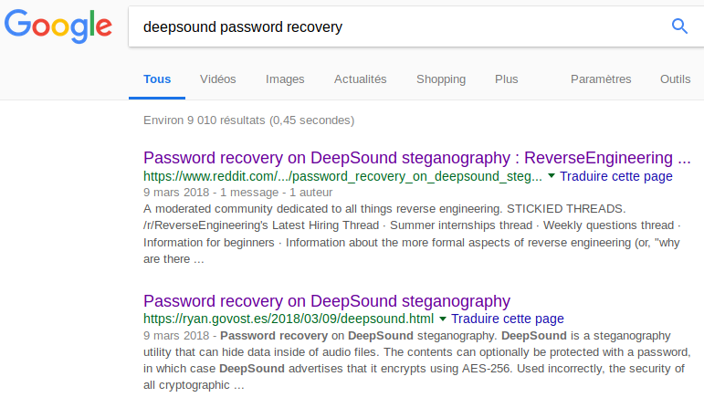

One part of the flag is a classic audio stegano using the spectrogram. Just use audacity or any software to see it.
The other part of the flag is hidden via deep sound, as induced by the description.
It's protected by a password, but a [study](https://ryan.govost.es/2018/03/09/deepsound.html) have shown it is not really secure.
Just use the last version of john the ripper from git to extract the hash and crack it.
Then extract the second part of the flag.

PS : Study was really difficult to find and it was pure guessing, as shown here :

